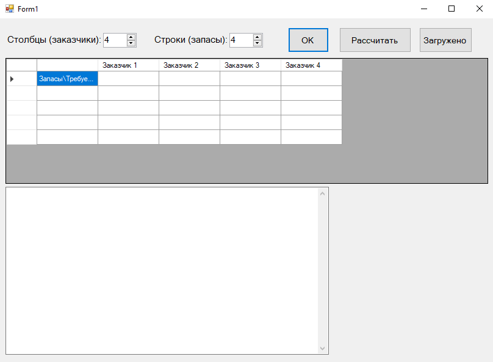

# Метод потенциалов
Метод потенциалов (модифицированный распределительный метод - МОДИ) является усовершенствованным вариантом распределительного метода и более практичным для решения транспортных и других задач этого типа. Сущность метода состоит в том, что для каждой строки и каждого столбца таблицы (матрицы) определяются потенциалы (числа), с помощью которых устанавливается необходимость заполнения свободных клеток. Метод потенциалов является модификацией симплекс-метода решения задачи линейного программирования применительно к транспортной задаче.

# Интерфейс
